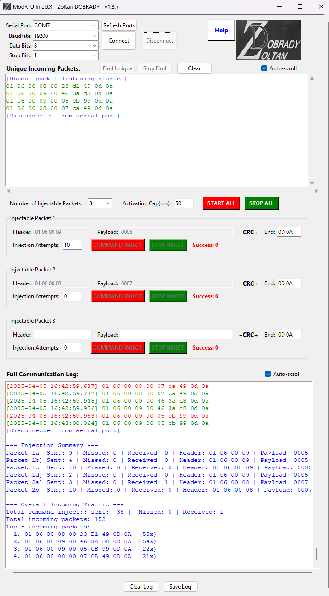

# ModRTU_InjectX

## Contents

- [Legal Notice](#Legal-Notice)
- [Overview](#overview)
- [Language Support](#language-support)
- [Validator Module](#validator-module)
---
## Legal Notice

- Author: Zoltán Dobrady  
- Website: www.cyberseclab.eu  
- Contact: zoltan.dobrady@hotmail.com  
- License: Creative Commons BY-NC 4.0  
- Version: v1.8.7 
- Copyright: © 2024–2025

This software is for educational and research purposes only or other non-commercial use.  
Use in an industrial environment is strictly forbidden.  
The author must be credited in all use cases.  
Commercial use requires written permission.

---


## Overview
**ModRTU__InjectX** is a Python-based software tool with a graphical user interface (GUI), specifically developed for research and educational purposes to enable a practical demonstration of the industrial communication protocol Modbus RTU. The platform also provides capabilities to simulate and log various cyber threats based on command injection techniques.



The software can establish a connection to a serial interface (e.g., COM port), allowing passive monitoring of data traffic and logging the entire communication flow on the bus. Events can be exported to a text file for further analysis. Moreover, the platform is capable of detecting and capturing unique incoming communication data frames, facilitating the review and identification of protocol structures.

This functionality enables users to assemble synthetically generated—fictitious—data packets, which can then be injected into the communication channel. The injection mechanism is based on an event-driven logic, constituting a core feature of the software.

During command injection, users can craft manipulated Modbus frames by defining custom parameters (Header, Payload, CRC, End). These packet blocks are automatically transmitted to the bus when a request-response pair matching the predefined header is received within a specified time window (Activation Gap - time). The packet transmission occurs instantaneously to ensure that the legitimate response remains valid only briefly before being overridden by the attacker’s manipulated message.

The number of transmission cycles can be configured via the Counter parameter. If set to zero, injection is performed continuously without interruption.

The program allows for the dynamic configuration of multiple independent command injection blocks, each with individually controlled start, stop, and parameter settings. This makes it possible to simulate parallel attack scenarios. Each block consists of three primary segments according to the Modbus RTU standard: Header, Payload, and End, which are linked by an automatically generated CRC code.

The software evaluates the success of the injected messages and records them in statistical logs. Injected packets that fail to elicit a meaningful response (i.e., the target system did not execute the manipulated command) are also logged. Additionally, statistics on successfully executed command injections are compiled.

## Language Support

The program includes built-in help content in **three languages**:

- English
- German
- Hungarian

You can switch between languages by clicking the corresponding flag icon in the top-right corner of the application's interface.


## Validator Module

**ModRTU_InjectX Validator** is a dedicated validation and analysis tool specifically developed to evaluate the output logs generated by the ModRTU_InjectX injection framework. It performs structural and temporal consistency checks on recorded Modbus RTU communication traces, ensuring the integrity and correctness of simulated attack scenarios—particularly in the context of AI-based intrusion detection system development.


In the screenshot above (**Figure 2**), the bottom ΔT plot displays a sudden cluster of low time deltas around packet index ~200, corresponding to rapid request-response sequences generated by simulated command injection blocks.

### Features

- **Automatic log parsing and validation**  
  Compares real packet logs with summary statistics, flags mismatches, validates pairings.

- **ΔT visualization**  
  Detects short response times to identify injection points and response anomalies.

- **Response tracking**  
  Clearly distinguishes between successful and failed injections.

- **Compact GUI**  
  Lightweight, responsive interface for visual inspection and statistical feedback.

### Example Output

```text
Packet Occurrence Consistency Validation – Summary vs. Log

No. Packet (Hex)                   Summary   Log   Result
----------------------------------------------------------
1   01 06 00 09 00 09 CE 99 0D 0A   20        40    OK – All responded
2   01 06 00 08 00 08 CE 09 0D 0A   20        40    OK – All responded
```

ΔT plots highlight successful injection rounds, where response times sharply drop due to real-time replies from the target device.

---

## Citation

If you use this software in a research project or academic work, please cite the original author and link to the GitHub repository:

> **Zoltán Dobrady** (2025). *ModRTU_InjectX: A Command Injection Simulation Tool for Industrial Cybersecurity Research*.  
> GitHub: [https://github.com/Dobrady/ModRTU_InjectX_distributions](https://github.com/Dobrady/ModRTU_InjectX_distributions)

---

## Contact

For questions, collaboration, or feedback:

zoltan.dobrady@hotmail.com  
www.cyberseclab.eu


